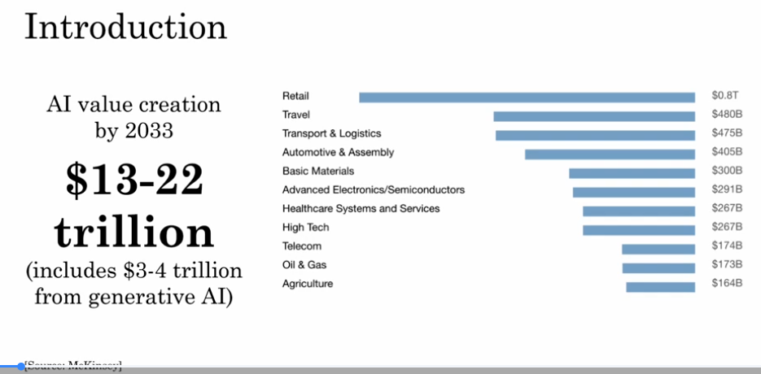

## Understanding AI

Generative AI, often referred to as Gen AI, is a type of artificial intelligence that can create new content, such as text, images, or audio, based on the data it has learned from. Imagine a talented artist who can paint beautiful pictures by learning from various styles and techniques. Similarly, Gen AI learns from existing data and then generates original content that resembles what it has learned.

For example, think of a chatbot that can write stories or answer questions. It uses patterns and information from countless texts to create responses that sound natural and engaging. This ability to generate new content makes Gen AI a powerful tool in many fields, from entertainment to business, helping people create and innovate in exciting ways! 

AI is transforming work and life, with a potential value creation of $13 to $22 trillion annually by 2033, primarily from generative AI and other AI technologies.

AI is already valuable in industries like software, retail, transportation, and more, with ongoing advancements in ANI and generative AI.

# What is Machine Learning

Machine Learning is a field of artificial intelligence where a system learns to map an input (A) to an output (B) by studying data.
The system improves its performance automatically by learning patterns from examples instead of being explicitly programmed for each task.
In simple terms:
👉 Input (A) → Machine Learning Model → Output (B)
The model learns this mapping from data.

From these examples, you can see that:

You give some input (email, audio, image, words, sensor data).
The machine learns how to produce the correct output (spam or not, text, translation, location, next word, etc.).
Then it can automatically perform the task on new, unseen data.

